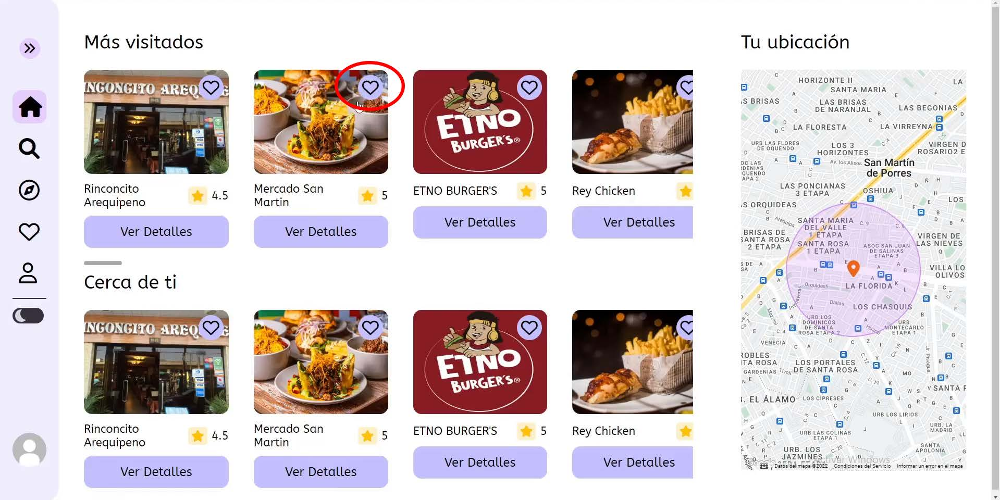

# Proyecto My Dates

## Integrantes

-   Vasquez Palomino, Ashel Joseph
-   Gonza Soto, Raquel Stacy
-   Alata Gutierrez, Jose Rodolfo
-   Lopez Terrones, Xiomy Ximena
-   Alvarado Arroyo, Diego AKira

## Descripción

My dates es una aplicación web que combina la planificación de salidas con la interacción social y la recomendación de lugares, creando así una plataforma completa para ayudar a los usuarios a organizar y disfrutar sus actividades de ocio.

### ¿En qué consiste?

El usuario pued elegir mediante un mapa interactivo, algún sitio donde desee planear una reunión. También, el usuario puede seleccionar el tipo de salida que va a ser, ya sea familiar, con amigos o con su pareja, así mismo, el usuario podrá elegir la fecha en la cual va a asistir a dicho lugar y luego también podrá indicar el presupuesto o los gastos que prevé realizar de tal forma que pueda tener un panorama de lo que va a necesitar. Además de estas características, en la página de inicio, se podrá ver los lugares más concurridos por los usuarios, es decir, aquellos lugares que han sido elegidos con mayor frecuencia, para que así otros usuarios también puedan tener una idea de donde ir la próxima vez que deseen salir, estas recomendaciones se mostrarían a modo de dinamizar la plataforma.



## Ejecutar en local

El proyecto consta de dos partes: frontend y backend. Ambos se basan en el lenguaje JavaScript y utilizan `npm` como manejador de paquetes.

### Backend

Para poder ejecutar el backend en un ambiente de desarrollo local es necesario contar con lo siguiente:

- **Un proyecto en GCP**: Esto es debido a que se hace una consulta a la api de google maps para obtener información acerca de un determinado lugar
- **NodeJS v16**
- **Un proyecto de Cloudinary**: Esto es para guardar las imágenes de perfil de los usuarios
- **Un cluster dentro de Mongo Atlas**: Esto es para poder guardar la información usando como base de datos MongoDB. (También se puede ejecutar mongoDB en local ya sea instalandolo o usando Docker)

#### Pasos

1. Creamos el archivo `.env` tomando como base el archivo de ejemplo `.env.example`

```bash
cp .env.example .env
```
2. Reemplazamos las variables de entorno
```bash
MONGODB_URI = <uri de la base de datos en mongodb>
SECRET = <un string cualquiera>
GOOGLE_API_KEY = <api key de nuestro proyecto en GCP>
```
3. Instalamos las dependencias
```bash
npm install
```
4. Levantamos la aplicación en modo local
```bash
npm run dev
```

### Frontend

Para poder ejecutar el frontend en un ambiente de desarrollo local es necesario contar con lo siguiente:

- **Un proyecto en GCP**: Esto es debido a que se hace uso de la API de Google Maps y Google Places para poder mostrar los lugares cercanos y a medida que el usuario interactúe con el mapa.
- **NodeJS v16**

#### Pasos

1. Ejecutamos el backend para poder guardar la URL dentro de las variables de entorno
2. Creamos el archivo `.env` tomando como base el archivo de ejemplo `.env.example`

```bash
cp .env.example .env
```
3. Reemplazamos las variables de entorno
```bash
REACT_APP_URI_BACKEND = <url del backend en local>
REACT_APP_GOOGLE_CLIENT_ID = <client id del proyecto en GCP>
REACT_APP_GOOGLE_API_KEY = <api key de nuestro proyecto en GCP>
```
4. Instalamos las dependencias
```bash
npm install
```
5. Levantamos la aplicación
```bash
npm run start
```
## Mantenimiento 

En el trabajo de mantenimiento de software, planeamos migrar desde la actual arquitectura de capas altamente acoplada a una arquitectura más modular y desacoplada. Este cambio busca mejorar la flexibilidad, facilitar la escalabilidad y reducir la complejidad del código. La transición se realizará de manera cuidadosa para minimizar posibles impactos en la funcionalidad existente, asegurando una transición suave hacia un mantenimiento más eficiente y sostenible a largo plazo